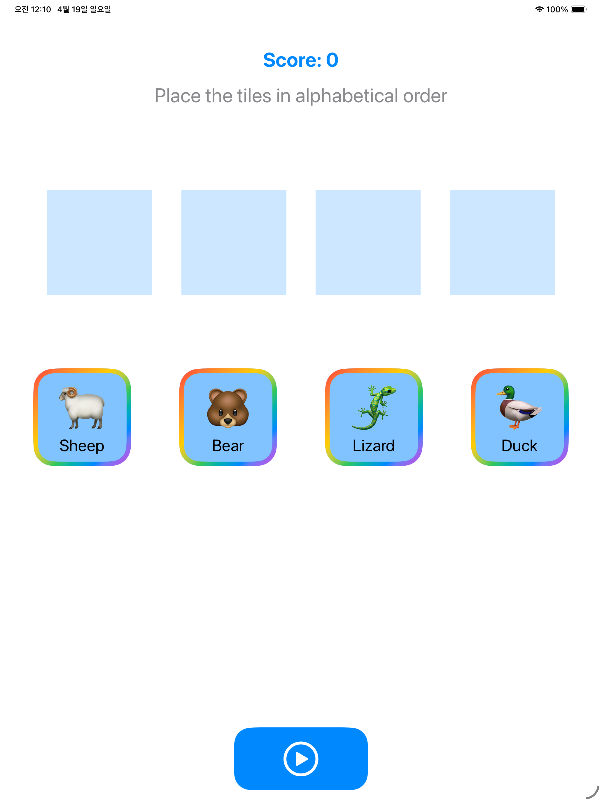
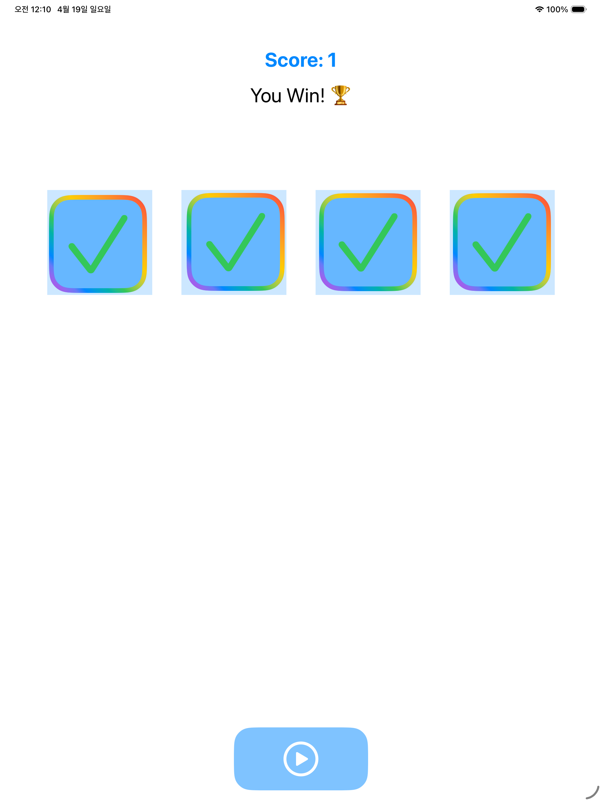
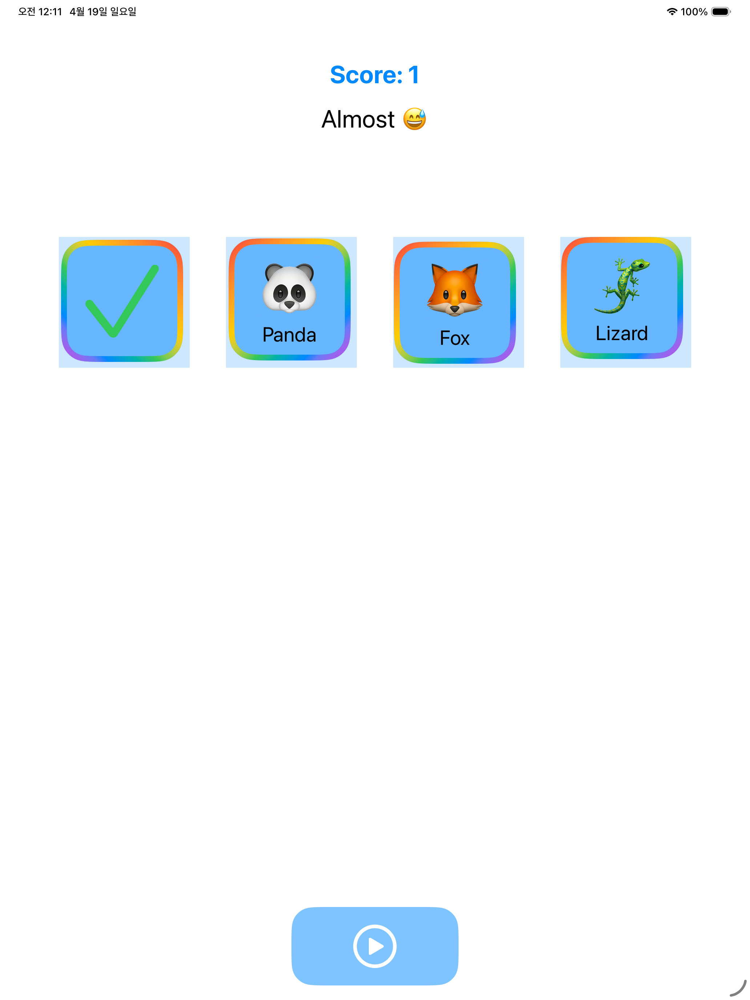

<h1>Alphabetizer</h1>

드래그 가능한 단어 타일을 알파벳 순서로 정렬하면서, `SwiftUI` 화면과 `@Observable` 상태 모델이 어떻게 연결되는지 연습한 작은 게임 프로젝트입니다. 사용자는 동물 이름이 적힌 타일을 좌우로 옮겨 정답 순서를 만들고, 제출 버튼을 눌러 정렬 결과를 확인할 수 있습니다. 정답이면 점수가 올라가고 새로운 문제가 생성되며, 오답이면 어떤 타일이 맞았는지 뒤집힌 체크 표시로 피드백을 받게 됩니다. 

<h2>프로젝트를 통해 배운 핵심 내용</h2>

| 항목 | 내용 |
|---|---|
| `@Observable` 모델 하나로 게임 상태를 통합 관리하는 방법 | `Alphabetizer` 클래스는 점수, 현재 메시지, 타일 배열을 한곳에서 관리하는 게임의 핵심 상태 객체입니다. `ContentView`와 하위 뷰들은 모두 이 객체를 `environment`로 공유합니다. |

이 구조를 통해 배운 점은:

- 화면마다 상태를 따로 들고 있지 않아도 공통 게임 상태를 함께 사용할 수 있음
- 모델 객체가 바뀌면 연결된 SwiftUI 화면이 자연스럽게 다시 그려짐
- 점수, 메시지, 타일 상태 같은 서로 연결된 데이터를 한 군데서 관리하기 쉬워짐

예를 들어 이 프로젝트에서는:

- `score`로 현재 점수를 표시하고
- `message`로 안내 문구와 결과 문구를 전환하며
- `tiles` 배열로 게임에 사용되는 단어 카드 전체를 제어합니다

| 항목 | 내용 |
|---|---|
| 환경 주입으로 모델을 앱 전체 화면에 전달하는 방식 | `AlphabetizerApp`은 `@State`로 게임 모델을 하나 생성하고, `ContentView().environment(alphabetizer)`로 루트 화면 아래에 주입합니다. |

이 부분을 통해 배운 핵심은:

- 앱 시작 지점에서 만든 상태 객체를 여러 하위 뷰가 공유할 수 있음
- 별도의 프로퍼티 전달 없이 `@Environment(Alphabetizer.self)`로 필요한 곳에서 바로 접근 가능
- 점수, 메시지, 제출 상태 같은 공통 정보를 뷰끼리 자연스럽게 공유할 수 있음

| 항목 | 내용 |
|---|---|
| 드래그 제스처로 타일 위치를 직접 바꾸는 방법 | `WordCanvas`는 각 타일에 `DragGesture`를 붙여 사용자가 손가락으로 끌어다 놓을 수 있게 구성되어 있습니다. 드래그 중에는 `value.location`을 `tile.position`에 반영해 화면 위치를 계속 갱신합니다. |

이 흐름을 통해 배운 점은:

- `SwiftUI` 제스처를 이용해 인터랙티브한 게임 UI를 만들 수 있음
- 모델의 좌표값이 곧 화면상의 위치가 되도록 연결할 수 있음
- 단순 리스트가 아니라 자유롭게 움직이는 오브젝트를 뷰로 표현할 수 있음

특히 이 프로젝트에서는:

- 타일마다 현재 위치를 저장하고
- `centeredOffset`으로 타일 중심 기준 드래그를 구현하며
- 배경 슬롯과 실제 타일을 겹쳐서 게임판처럼 보이게 구성했습니다

| 항목 | 내용 |
|---|---|
| 사용자 배치 결과와 정답 순서를 비교하는 게임 판정 로직 | `submit()`에서는 현재 화면상 x좌표 기준 정렬 결과와, 단어 자체를 알파벳 순으로 정렬한 결과를 비교해 정답 여부를 판정합니다. |

이 로직을 통해 배운 점은:

- 화면에서의 배치 순서를 데이터로 다시 해석할 수 있음
- 사용자 조작 결과와 정답 기준을 각각 별도 정렬 방식으로 비교할 수 있음
- 단순 UI 작업을 넘어 실제 게임 규칙을 모델 레이어에 담을 수 있음

이 프로젝트에서는:

- `position.x` 기준 정렬로 사용자의 배치 순서를 계산하고
- `lexicographicallyPrecedes`로 정답 순서를 계산한 뒤
- 두 배열이 같은지 비교해 성공 여부를 결정합니다

| 항목 | 내용 |
|---|---|
| 정답/오답 결과를 메시지와 점수로 반영하는 상태 전환 | 제출 후 정답이면 점수가 1 증가하고 메시지가 `youWin`으로, 오답이면 `tryAgain`으로 바뀝니다. 이후 잠시 결과를 보여준 뒤 다시 기본 안내 문구로 돌아갑니다. |

이 부분에서 배운 점은:

- 게임 결과를 여러 UI 요소에 동시에 반영할 수 있음
- 하나의 액션이 점수, 메시지, 버튼 상태에 연쇄적으로 영향을 줄 수 있음
- 짧은 상태 전환만으로도 사용자에게 명확한 피드백을 줄 수 있음

| 항목 | 내용 |
|---|---|
| 비동기 지연으로 결과 표시 후 다음 라운드를 준비하는 방법 | `submit()` 내부의 `Task { @MainActor in ... }`는 2초 동안 결과를 보여준 뒤, 정답이면 새 단어를 생성하고 타일을 다시 뒤집은 다음 안내 메시지를 복구합니다. |

이 구조를 통해 배운 핵심은:

- 메인 액터에서 UI 상태를 안전하게 순차 업데이트할 수 있음
- 즉시 화면을 초기화하지 않고 잠깐 결과를 보여주는 게임 연출을 만들 수 있음
- 성공 시에만 다음 라운드로 넘어가도록 흐름을 제어할 수 있음

| 항목 | 내용 |
|---|---|
| 일부 정답 타일만 뒤집어 피드백을 주는 방식 | 제출 후 현재 순서와 정답 순서를 `zip`으로 비교하면서 같은 위치의 타일만 `flipped = true`로 바꿉니다. 이때 타일은 체크마크가 보이도록 3D 회전 애니메이션을 적용합니다. |

이 방식을 통해 배운 점은:

- 전체 정답/오답만이 아니라 부분 정답 피드백도 제공할 수 있음
- 모델의 불리언 상태 하나로 카드 앞뒤 전환 연출을 만들 수 있음
- 애니메이션과 게임 판정 로직을 자연스럽게 결합할 수 있음

| 항목 | 내용 |
|---|---|
| 랜덤 단어 선택 시 정답 상태로 시작하지 않도록 보정하는 방법 | `Vocabulary.selectRandomWords(count:)`는 무작위 단어를 뽑은 뒤, 이미 알파벳 순으로 정렬된 상태라면 다시 섞어 항상 게임이 필요한 상태로 시작하게 만듭니다. |

이 부분에서 배운 점은:

- 랜덤 데이터도 게임 규칙에 맞게 후처리해야 할 수 있음
- 시작부터 정답인 문제를 방지해 플레이 경험을 안정적으로 만들 수 있음
- 단어 집합과 게임 규칙을 분리해 설계할 수 있음

| 항목 | 내용 |
|---|---|
| 모델 데이터에서 화면 표현 요소를 계산하는 방식 | `Tile`은 단어 자체 외에도 위치, 뒤집힘 여부, 아이콘 이모지를 함께 관리합니다. `Vocabulary.icons` 딕셔너리를 사용해 각 단어에 맞는 동물 이모지를 표시합니다. |

이 흐름을 통해 배운 점은:

- 순수 데이터와 화면에 필요한 파생 표현을 함께 설계할 수 있음
- 문자열만 보여주는 대신 시각 요소를 추가해 더 직관적인 UI를 만들 수 있음
- 모델 타입이 뷰 표현을 위한 보조 정보를 제공할 수도 있음

| 항목 | 내용 |
|---|---|
| 작은 뷰를 조합해 게임 화면을 구성하는 방법 | `ContentView`는 `ScoreView`, `MessageView`, `WordCanvas`, `SubmitButton`을 세로로 조합해 하나의 게임 화면을 만듭니다. 각각의 뷰는 역할이 분리되어 있어 읽기 쉽고 수정도 쉽습니다. |

이 과정을 통해 배운 점은:

- 화면 요소를 역할별로 쪼개면 구조를 이해하기 쉬워짐
- 같은 환경 모델을 공유하면서도 뷰 책임을 분리할 수 있음
- 작은 뷰 단위로 Preview를 만들기 쉬워짐

| 항목 | 내용 |
|---|---|
| 상태에 따라 버튼 활성화 여부를 제어하는 방법 | `SubmitButton`은 현재 메시지가 `instructions`일 때만 활성화되도록 되어 있습니다. 결과를 보여주는 동안에는 버튼을 비활성화해 중복 제출을 막습니다. |

이 부분에서 배운 점은:

- 단순한 조건식만으로도 사용자 입력 흐름을 제어할 수 있음
- 게임 상태와 상호작용 가능 상태를 자연스럽게 연결할 수 있음
- 버튼의 `disabled`와 시각적 투명도를 함께 사용해 현재 상태를 명확히 전달할 수 있음

<h2>파일별 역할 정리</h2>

| 파일 | 역할 |
|---|---|
| `AlphabetizerApp.swift` | 앱 시작 지점, 게임 모델 생성 및 환경 주입 |
| `ContentView.swift` | 점수, 메시지, 타일 캔버스, 제출 버튼을 조합하는 메인 화면 |
| `Alphabetizer.swift` | 게임 규칙, 점수 처리, 정답 판정, 다음 라운드 준비를 담당하는 핵심 모델 |
| `Tile.swift` | 단어 타일의 식별자, 위치, 뒤집힘 여부, 아이콘 계산 로직 정의 |
| `Vocabulary.swift` | 단어 목록, 이모지 매핑, 무작위 문제 생성 로직 정의 |
| `Message.swift` | 안내/성공/실패 메시지 상태 정의 |
| `WordCanvas.swift` | 타일 배치 영역, 드래그 처리, 초기 위치 재설정 담당 |
| `TileView.swift` | 단어 타일의 카드 UI와 뒤집힘 애니메이션 표현 |
| `ScoreView.swift` | 현재 점수 표시 |
| `MessageView.swift` | 현재 게임 상태 메시지 표시 |
| `SubmitButton.swift` | 제출 버튼 UI와 활성화 조건 처리 |

<h2>이 프로젝트에서 특히 중요했던 포인트</h2>

이번 프로젝트의 핵심은 단순히 단어를 보여주는 데서 끝나는 것이 아니라, 사용자가 직접 타일을 움직인 결과를 모델이 해석하고, 그 결과를 다시 점수와 애니메이션, 메시지로 연결하는 흐름을 만드는 데 있습니다.

정리하면 다음 세 가지가 가장 중요했습니다.

- `@Observable` 모델을 중심으로 게임 상태를 한곳에서 관리하기
- 드래그된 타일의 좌표를 기반으로 사용자의 정렬 결과를 판정하기
- 제출 후 점수, 메시지, 카드 뒤집기, 다음 문제 생성까지 하나의 게임 사이클로 연결하기

<h2>개선해볼 수 있는 점</h2>

- 현재는 x좌표만으로 순서를 판정하므로 타일 스냅 정렬 기능 추가
- 단어 개수나 난이도를 선택할 수 있는 옵션 화면 추가
- 라운드별 타이머나 최고 점수 기록 기능 추가
- 정답 단어 순서를 힌트로 보여주는 보조 기능 추가

<h2>한 줄 회고</h2>

이 프로젝트는 작은 단어 정렬 게임이지만, `SwiftUI` 제스처, 상태 모델링, 비동기 UI 갱신, 컴포넌트 분리를 함께 연습하기에 아주 좋은 예제였습니다.

<h2>스크린샷</h2>

| | | |
|---|---|---|
|  |  |  |
