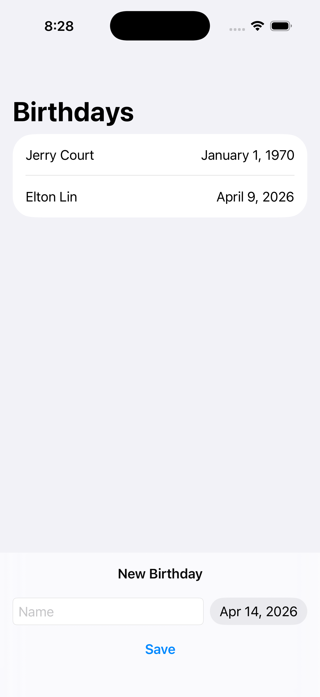
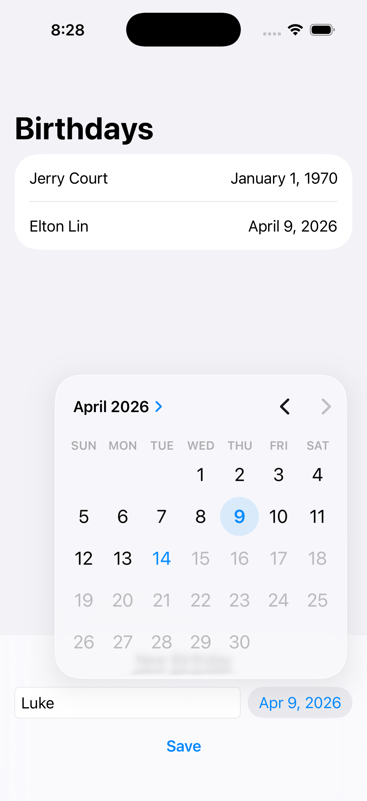
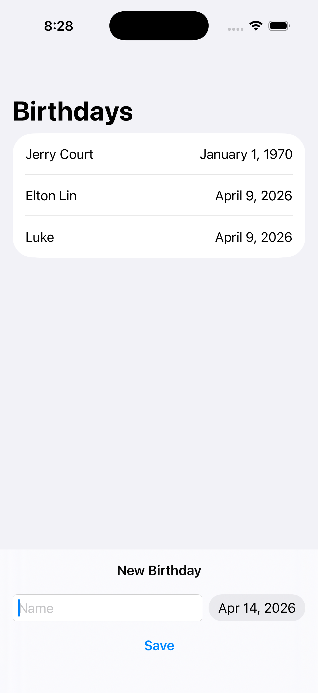

<h1>Birthdays</h1>

간단한 친구 생일 관리 앱을 만들면서 `SwiftUI`와 `SwiftData`를 함께 사용하는 방법을 연습한 프로젝트입니다. 이름과 생일을 입력해 저장하고, 저장된 데이터를 목록으로 보여주며, 오늘 생일인 친구를 화면에서 강조해 표시합니다. 

<h2>프로젝트를 통해 배운 핵심 내용</h2>

| 항목 | 내용 |
|---|---|
| `SwiftData` 모델 정의 방법 | `Friend`는 `@Model`이 붙은 클래스이며, `name`과 `birthday`를 저장합니다. |
  
이 구조를 통해 배운 점은:  
  
- SwiftData에서는 저장할 데이터를 `@Model`로 정의한다.  
- 화면용 구조체가 아니라, 실제로 저장 가능한 모델 객체를 따로 설계할 수 있다.  
- 앱이 커질수록 데이터 구조를 먼저 명확하게 잡는 습관이 중요하다.  
  
이 프로젝트에서는 `Friend` 하나가 곧 앱의 핵심 데이터 단위입니다.

| 항목 | 내용 |
|---|---|
| `modelContainer`로 앱 전체 저장 환경 연결하기 | `BirthdaysApp`에서 `.modelContainer(for: Friend.self)`를 설정해 SwiftData 저장소를 연결합니다. |
  
이 코드를 통해 배운 점은, 모델을 만들었다고 바로 저장이 되는 것이 아니라  
앱 시작 지점에서 어떤 모델을 저장할지 등록해야 한다는 것입니다.  
  
즉 이 프로젝트에서는:  
  
- `BirthdaysApp`이 저장 환경을 준비하고  
- `ContentView`는 그 환경을 사용해 데이터를 읽고 씁니다.

| 항목 | 내용 |
|---|---|
| `@Query`로 저장된 데이터를 자동 조회하기 | `ContentView`의 `@Query(sort: \Friend.birthday)`가 저장된 친구 목록을 생일 기준으로 정렬해 가져옵니다. |
  
이 방식의 장점은:  
  
- 별도 fetch 로직을 직접 쓰지 않아도 됨  
- 저장된 데이터가 바뀌면 화면도 함께 갱신됨  
- SwiftUI의 선언형 UI와 자연스럽게 연결됨  
  
이 프로젝트는 작은 예제지만, 데이터 조회와 화면 갱신이 자동으로 연결되는 흐름을 체감하기 좋습니다.

| 항목 | 내용 |
|---|---|
| `modelContext`로 데이터 추가하기 | `@Environment(\.modelContext)`로 컨텍스트를 가져오고, `context.insert(newFriend)`로 새 데이터를 저장합니다. |
  
이 과정을 통해 배운 핵심은:  
  
- 입력값으로 모델 객체를 생성하고  
- 컨텍스트에 삽입하면 저장 대상이 되며  
- 저장 결과가 곧바로 목록 UI에 반영된다는 점입니다.  
  
즉, SwiftData에서는 `modelContext`가 생성, 수정, 삭제의 중심 역할을 합니다.

| 항목 | 내용 |
|---|---|
| `@State`로 입력 상태 관리하기 | `newName`, `newDate`를 `@State`로 두고 `TextField`, `DatePicker`와 연결합니다. |
  
이 구조를 통해 배운 점은:  
  
- 입력 폼의 현재 값을 상태로 관리할 수 있음  
- 사용자의 입력이 UI와 즉시 동기화됨  
- 저장 후 값을 초기화해 다시 입력 가능한 흐름을 만들 수 있음  
  
SwiftUI에서는 이런 작은 입력 상태도 명확하게 선언하는 습관이 중요합니다.

| 항목 | 내용 |
|---|---|
| 날짜 입력 제한과 날짜 포맷 출력 | `DatePicker`에 `Date.distantPast...Date.now` 범위를 지정하고, 목록에서는 날짜를 `.month(.wide).day().year()` 형식으로 보여줍니다. |
  
이 부분을 통해 배운 점은:  
  
- 날짜 선택 범위를 제한해 잘못된 입력을 줄일 수 있음  
- `Text(..., format:)`으로 날짜를 가독성 있게 표시할 수 있음  
- 데이터 저장뿐 아니라 사용자에게 어떻게 보일지도 함께 설계해야 한다는 점입니다.

| 항목 | 내용 |
|---|---|
| 계산 프로퍼티로 UI 강조 조건 만들기 | `Friend` 모델의 `isBirthdayToday` 계산 프로퍼티를 사용해 오늘 생일인 친구만 아이콘과 굵은 글씨로 표시합니다. |
  
이 구조의 장점은:  
  
- "오늘 생일인지"라는 규칙을 뷰가 아니라 모델에 둘 수 있음  
- UI는 조건 결과만 받아서 표현에 집중할 수 있음  
- 비즈니스 로직과 화면 표현이 자연스럽게 분리됨  
  
작은 기능이지만, 로직을 어디에 둘지 생각하는 연습이 되는 부분입니다.

| 항목 | 내용 |
|---|---|
| 선언형 UI로 목록과 입력 화면 구성하기 | `List`, `NavigationStack`, `safeAreaInset`, `Button`, `TextField`, `DatePicker`를 조합해 하나의 흐름으로 구성되어 있습니다. |
  
이 프로젝트를 통해 배운 점은, SwiftUI에서는  
"현재 데이터가 이 상태이므로 이런 화면을 보여준다"는 식으로 생각하는 것이 자연스럽다는 점입니다.  
  
예를 들어 이 프로젝트에서는:  
  
- 저장된 친구가 있으면 목록에 보여주고  
- 새 입력값은 하단 영역에서 받고  
- 저장하면 목록이 바로 다시 그려집니다.  
  
즉, 명령형으로 화면을 일일이 갱신하기보다 상태와 데이터를 기준으로 화면을 선언합니다.

| 항목 | 내용 |
|---|---|
| 도메인에 맞는 날짜 비교의 중요성 | 현재 `isBirthdayToday`는 `Calendar.current.isDateInToday(birthday)`를 사용합니다. |
  
이 구현을 보며 배울 수 있는 점은,  
"기술적으로 동작하는 코드"와 "도메인에 맞는 코드"는 다를 수 있다는 것입니다.  
  
생일 앱이라면 보통 연도는 무시하고 월/일만 비교하는 편이 자연스럽습니다.  
즉 이 프로젝트는 날짜 비교 로직을 설계할 때 무엇을 기준으로 판단해야 하는지도 함께 생각하게 만듭니다.

<h2>파일별 역할 정리</h2>

| 파일 | 역할 |
|---|---|
| `BirthdaysApp.swift` | 앱 시작 지점, SwiftData 컨테이너 연결 |
| `ContentView.swift` | 친구 목록 표시, 새 생일 입력, 저장 처리 |
| `Friend.swift` | 친구 데이터 모델 정의, 오늘 생일 여부 계산 |

<h2>이 프로젝트에서 특히 중요했던 포인트</h2>

이번 프로젝트의 핵심은 단순히 생일 목록을 만드는 것이 아니라, "저장할 데이터는 모델로 정의하고, 조회는 `@Query`로 받고, 입력 상태는 `@State`로 관리하며, 저장은 `modelContext`로 처리한다"는 SwiftUI + SwiftData의 기본 흐름을 직접 연습한 데 있습니다.  
  
정리하면 다음 세 가지가 가장 중요했습니다.  
  
- `@Model`과 `modelContainer`로 저장 구조 연결하기  
- `@Query`와 `modelContext`로 조회와 저장 흐름 이해하기  
- `@State`와 계산 프로퍼티를 활용해 UI와 로직 분리하기 |

<h2>개선해볼 수 있는 점</h2>

- 이름이 비어 있을 때 저장 방지  
- 친구 삭제 기능 추가  
- 친구 정보 수정 기능 추가  
- 월/일 기준으로 오늘 생일 판별 로직 개선  
- 정렬 기준 변경 기능 추가  
- 빈 목록 상태 UI 추가 |

<h2>한 줄 회고</h2>

이 프로젝트는 작은 CRUD 예제이지만, SwiftUI의 상태 관리와 SwiftData의 저장 흐름을 함께 익히기에 좋은 예제였고,  
특히 "모델 정의 → 조회 → 입력 → 저장 → 자동 UI 반영"의 연결 구조를 이해하는 데 도움이 되었습니다.

<h2>스크린샷</h2>

| | | |
|---|---|---|
|  |  |  |
