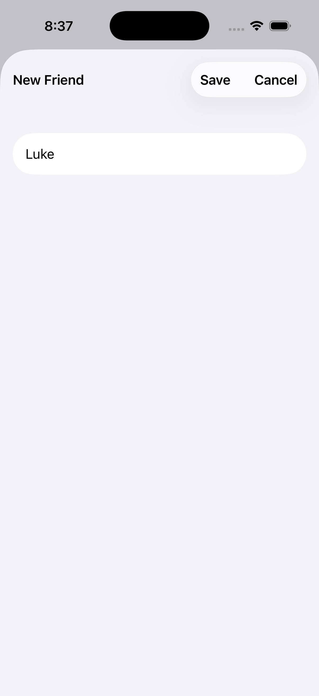
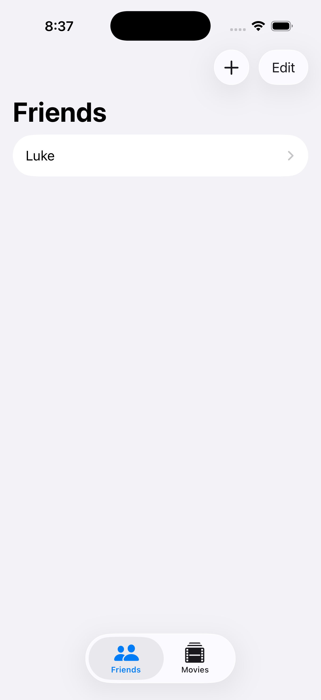
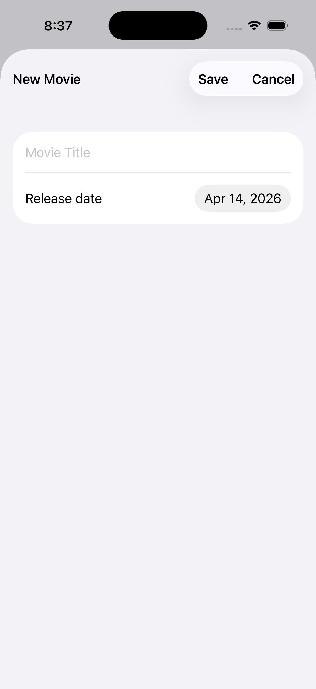

<h1>FriendsFavoriteMovies</h1>

친구 목록과 영화 목록을 각각 관리하는 작은 앱을 만들면서 `SwiftData`의 모델 정의 방식과 `SwiftUI`에서 데이터 조회, 추가, 수정, 삭제 흐름을 연습한 프로젝트입니다. `TabView`로 두 영역을 나누고, 각 탭에서 리스트와 상세 화면을 연결해 간단한 데이터 관리 앱 구조를 익힐 수 있습니다. 

<h2>프로젝트를 통해 배운 핵심 내용</h2>

| 항목 | 내용 |
|---|---|
| `@Model`로 데이터를 영속 모델로 선언하는 방법 | 이 프로젝트의 핵심 데이터는 `Friend`와 `Movie` 두 모델입니다. 각각 `@Model`로 선언되어 있어 `SwiftData`가 저장 가능한 객체로 인식합니다. |
  
이 구조를 통해 배운 점은:  
  
- 단순한 클래스도 `@Model`을 붙이면 앱의 저장 대상이 될 수 있음  
- 화면 코드와 별개로 데이터 구조를 명확히 정의할 수 있음  
- 속성 설계 자체가 앱의 데이터 설계가 됨  
  
예를 들어 이 프로젝트에서는:  
  
- `Friend`는 `name`만 가지는 간단한 모델  
- `Movie`는 `title`과 `releaseDate`를 가지는 모델  
  
처럼 역할에 따라 데이터를 분리해 관리하고 있습니다.

| 항목 | 내용 |
|---|---|
| `SwiftData` 컨테이너를 앱 전체에 주입하는 방식 | `FriendsFavoriteMoviesApp`에서는 `.modelContainer(for: [Movie.self, Friend.self])`를 통해 앱 전체에서 같은 데이터 저장소를 사용할 수 있도록 구성하고 있습니다. |
  
이 부분을 통해 배운 핵심은:  
  
- 앱 시작 지점에서 모델 타입을 한 번 등록하면 하위 뷰들이 같은 저장소를 공유할 수 있음  
- 별도로 데이터를 전달하지 않아도 `Environment` 기반으로 접근 가능  
- 데이터 관리 책임을 앱 루트에서 일관되게 설정할 수 있음

| 항목 | 내용 |
|---|---|
| `@Query`로 저장된 데이터를 자동 조회하는 방법 | `FriendList`와 `MovieList`에서는 각각 `@Query(sort: \Friend.name)`와 `@Query(sort: \Movie.title)`를 사용해 데이터를 불러옵니다. |
  
이 방식의 장점은:  
  
- 별도의 fetch 코드 없이 목록을 바로 UI에 연결할 수 있음  
- 정렬 기준을 선언적으로 지정할 수 있음  
- 데이터가 바뀌면 리스트도 자동으로 반영됨  
  
즉, SwiftUI와 SwiftData가 연결되면서  
"현재 저장된 데이터를 그대로 화면에 선언한다"는 흐름을 자연스럽게 익힐 수 있습니다.

| 항목 | 내용 |
|---|---|
| `ModelContext`로 추가와 삭제를 처리하는 방식 | 각 리스트 화면에서는 `@Environment(\.modelContext)`를 통해 컨텍스트를 가져오고, 새 항목 추가 시 `insert`, 삭제 시 `delete`를 호출합니다. |
  
이 코드를 통해 배운 점:  
  
- 데이터 생성은 모델 객체를 만든 뒤 컨텍스트에 삽입  
- 리스트 삭제는 선택된 인덱스를 기준으로 컨텍스트에서 제거  
- 화면 이벤트와 데이터 저장 동작을 자연스럽게 연결 가능  
  
예를 들어:  
  
- `Add Friend` 버튼은 빈 이름의 `Friend`를 생성 후 sheet 표시  
- `Add movie` 버튼은 기본 날짜를 가진 `Movie`를 생성 후 sheet 표시  
- 편집 모드에서는 리스트 항목을 바로 삭제 가능  
  
하도록 구현되어 있습니다.

| 항목 | 내용 |
|---|---|
| `@Bindable`로 모델 객체를 화면에서 직접 수정하는 방법 | `FriendDetail`과 `MovieDetail`은 각각 `@Bindable var friend`, `@Bindable var movie`를 사용해 모델 속성을 폼 입력과 직접 연결합니다. |
  
이 구조를 통해 배운 핵심은:  
  
- 저장된 모델 객체를 상세 화면에서 바로 편집 가능  
- 별도의 중간 상태 없이 `TextField`, `DatePicker`와 즉시 연결 가능  
- 데이터 변경이 모델 객체에 곧바로 반영되는 SwiftData 스타일을 경험할 수 있음  
  
이 프로젝트에서는:  
  
- 친구 이름은 `TextField`로 수정  
- 영화 제목은 `TextField`로 수정  
- 개봉일은 `DatePicker`로 수정  
  
하는 식으로 폼 기반 편집을 구성하고 있습니다.

| 항목 | 내용 |
|---|---|
| 새 항목 생성 흐름을 `sheet(item:)`로 분리하는 방식 | 리스트 화면에서는 `@State`로 `newFriend` 또는 `newMovie`를 들고 있다가, 새 모델이 생성되면 시트가 열리도록 구성되어 있습니다. |
  
이 방식 덕분에:  
  
- 목록 화면과 생성 화면의 책임을 분리할 수 있음  
- 새 데이터 생성 직후 바로 상세 입력 화면으로 이동 가능  
- 생성 취소 시 컨텍스트에서 삭제하는 흐름도 깔끔하게 처리 가능  
  
특히 이 프로젝트에서는 `isNew` 플래그를 이용해  
새 항목일 때만 `Save`, `Cancel` 버튼을 보여주도록 만들었습니다.

| 항목 | 내용 |
|---|---|
| `NavigationSplitView`와 `NavigationLink`로 목록-상세 구조 만들기 | 친구와 영화 탭 모두 `NavigationSplitView`를 사용해 왼쪽에는 목록, 오른쪽에는 상세 내용을 보여주는 구조를 가지고 있습니다. |
  
이 부분에서 배운 점은:  
  
- 데이터 목록과 상세 편집 화면을 명확히 분리할 수 있음  
- `NavigationLink`를 통해 선택된 모델을 상세 화면으로 전달할 수 있음  
- iPad/macOS 스타일의 마스터-디테일 구조를 SwiftUI 방식으로 구성할 수 있음  
  
아무 항목도 선택되지 않았을 때는  
`Select a friend`, `Select a movie` 같은 안내 문구를 보여주도록 처리되어 있습니다.

| 항목 | 내용 |
|---|---|
| `TabView`로 서로 다른 데이터 도메인을 나누는 방법 | `ContentView`에서는 `Friends` 탭과 `Movies` 탭을 분리해 각 기능을 독립적으로 탐색할 수 있도록 구성했습니다. |
  
이 과정을 통해 배운 점은,  
하나의 앱 안에서도 데이터 종류별로 화면 흐름을 분리하면 구조를 더 단순하게 유지할 수 있다는 점입니다.  
  
즉 이 프로젝트는:  
  
- 사람 데이터 관리 영역  
- 영화 데이터 관리 영역  
  
을 탭 단위로 나누어 작은 CRUD 예제를 두 개 합친 형태로 볼 수 있습니다.

| 항목 | 내용 |
|---|---|
| 메모리 전용 샘플 데이터로 Preview를 구성하는 방법 | `SampleData`는 메모리 전용 `ModelContainer`를 만들고 샘플 친구와 영화를 삽입해 Preview에서 사용할 수 있게 합니다. |
  
이 구조의 장점은:  
  
- 실제 저장 데이터 없이도 미리보기를 안정적으로 확인 가능  
- 여러 화면에서 같은 샘플 모델을 재사용 가능  
- 테스트용 또는 학습용 데이터 구성을 코드로 명확히 유지할 수 있음  
  
따라서 Preview에서도 실제 앱과 비슷한 데이터 흐름을 확인할 수 있습니다.

<h2>파일별 역할 정리</h2>

| 파일 | 역할 |
|---|---|
| `FriendsFavoriteMoviesApp.swift` | 앱 시작 지점과 `modelContainer` 설정 |
| `ContentView.swift` | `TabView`로 친구/영화 탭 구성 |
| `Friend.swift` | 친구 데이터 모델 정의 |
| `Movie.swift` | 영화 데이터 모델 정의 |
| `FriendList.swift` | 친구 목록 조회, 추가, 삭제 화면 |
| `MovieList.swift` | 영화 목록 조회, 추가, 삭제 화면 |
| `FriendDetail.swift` | 친구 이름 편집 화면 |
| `MovieDetail.swift` | 영화 제목과 개봉일 편집 화면 |
| `SampleData.swift` | Preview용 메모리 기반 샘플 데이터 구성 |

<h2>이 프로젝트에서 특히 중요했던 포인트</h2>

이번 프로젝트의 핵심은 단순히 친구와 영화를 나열하는 것이 아니라, `SwiftData` 모델을 정의하고, `@Query`로 조회하고, `@Bindable`로 수정하고, `ModelContext`로 생성/삭제하는 전체 흐름을 작은 예제로 직접 익힌 데 있습니다.  
  
정리하면 다음 세 가지가 가장 중요했습니다.  
  
- `@Model`로 앱의 데이터를 명확히 정의하기  
- `@Query`와 `ModelContext`로 CRUD 흐름 연결하기  
- `NavigationSplitView`와 `sheet`를 조합해 목록과 편집 화면 분리하기 |

<h2>개선해볼 수 있는 점</h2>

- 친구와 영화 사이의 즐겨찾기 관계 추가  
- 빈 제목이나 빈 이름 저장 방지  
- 개봉일 정렬, 검색 기능 추가  
- 삭제 전 확인 다이얼로그 추가  
- 테스트 코드로 CRUD 동작 검증 확장 |

<h2>한 줄 회고</h2>

이 프로젝트는 작은 데이터 관리 앱이지만, `SwiftData`와 `SwiftUI`를 함께 사용하면서 모델 설계, 데이터 조회, 폼 편집, 시트 기반 생성 흐름까지 한 번에 연습할 수 있는 좋은 예제였습니다.

<h2>스크린샷</h2>

| | | |
|---|---|---|
|  |  |  |
