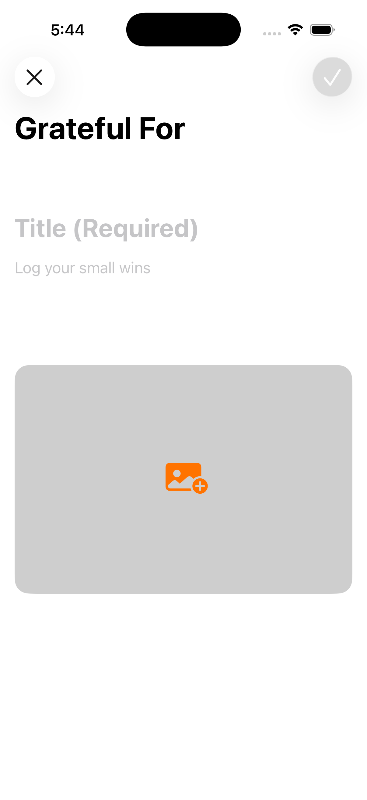
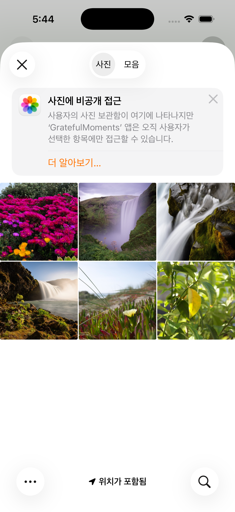
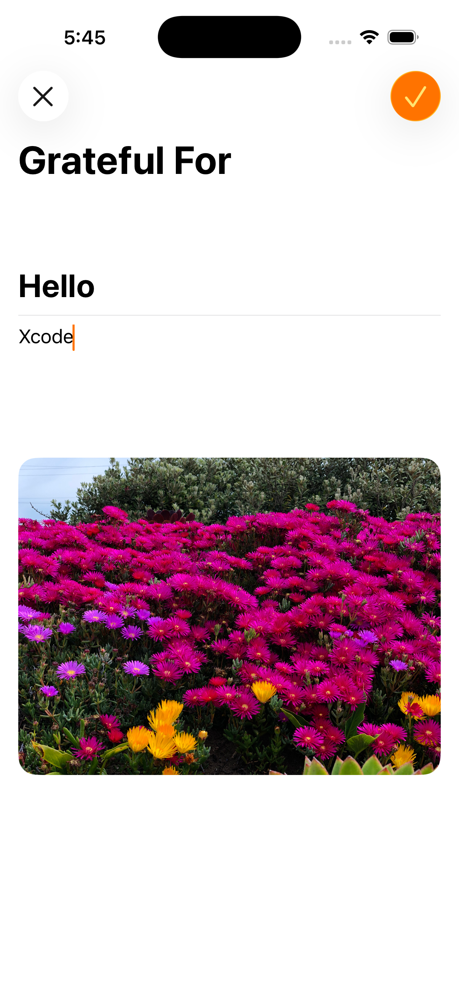
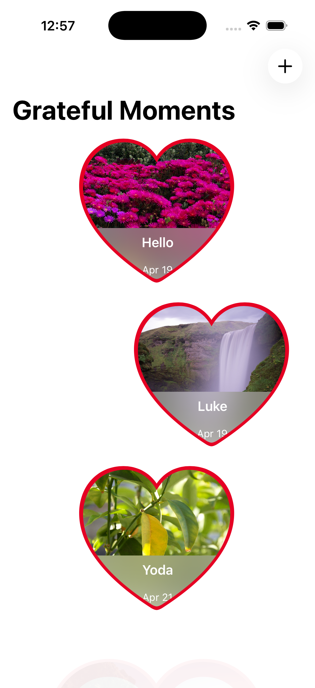
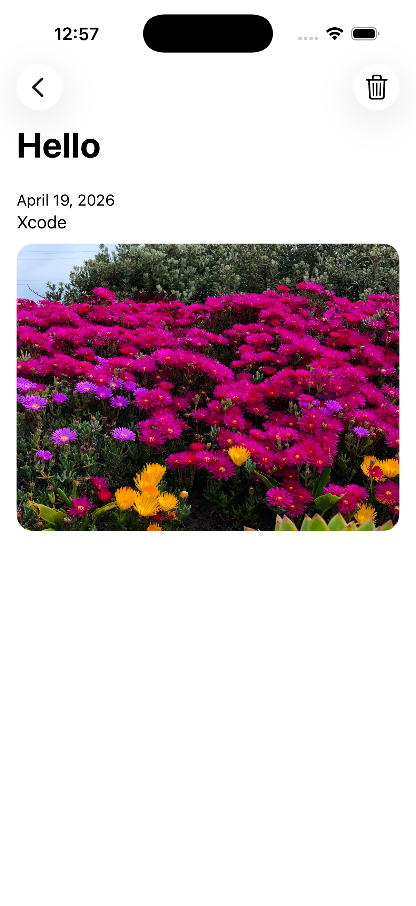
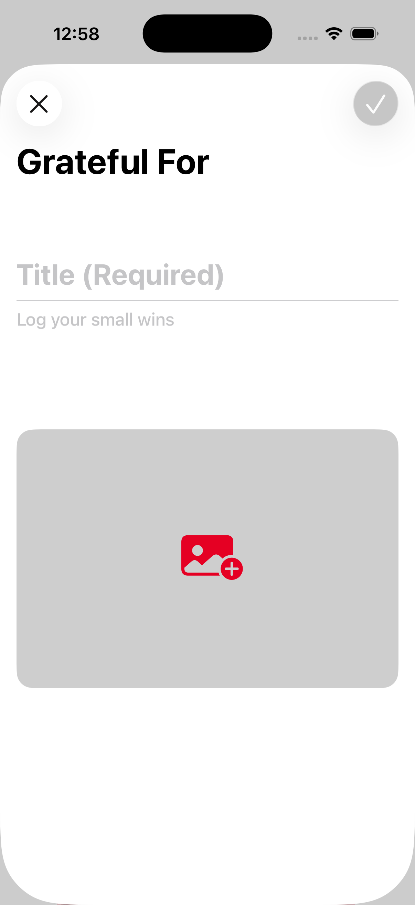

<h1>GratefulMoments</h1>

작은 감사의 순간을 기록하는 `SwiftUI` 기반 저널 앱 프로젝트입니다. 사용자는 제목, 메모, 사진을 함께 입력해 하나의 `Moment`를 만들 수 있고, 이 데이터는 `SwiftData` 모델로 저장됩니다. 현재 코드 기준으로는 감사 기록을 작성하는 입력 화면과 데이터 저장 구조가 구현되어 있으며, 이후 목록 화면과 상세 화면으로 확장할 수 있는 형태로 프로젝트가 준비되어 있습니다. 

<h2>프로젝트를 통해 배운 핵심 내용</h2>

| 항목 | 내용 |
|---|---|
| `SwiftData` 모델로 감사 기록 데이터를 정의하는 방법 | `Moment`는 제목, 메모, 사진 데이터, 작성 시각을 하나의 모델로 묶어 관리합니다. `@Model`을 사용해 앱에서 만든 기록을 저장 가능한 데이터 타입으로 선언했습니다. |

이 구조를 통해 배운 점은:

- 화면에서 입력받는 값을 앱 데이터 모델로 자연스럽게 연결할 수 있음
- 문자열뿐 아니라 이미지 바이너리 데이터와 날짜도 함께 저장할 수 있음
- 하나의 기록 단위를 명확한 타입으로 만들면 이후 목록, 상세 화면 구현이 쉬워짐

예를 들어 이 프로젝트에서는:

- `title`로 감사한 순간의 제목을 저장하고
- `note`로 자세한 감정이나 상황을 남기며
- `imageData`와 `timestamp`로 사진과 작성 시점을 함께 보관합니다

| 항목 | 내용 |
|---|---|
| 앱 전역에서 사용할 데이터 컨테이너를 구성하는 방식 | `DataContainer`는 `ModelContainer`와 `ModelContext`를 감싸며, 앱 전체에서 감사 기록 데이터를 읽고 저장하는 진입점 역할을 합니다. |

이 부분을 통해 배운 핵심은:

- 저장소 관련 설정을 한곳에 모아두면 화면 코드가 단순해짐
- 루트 앱에서 컨테이너를 만들어 하위 뷰에 주입할 수 있음
- 실제 저장소와 샘플 데이터용 메모리 저장소를 분리해 Preview를 구성할 수 있음

이 프로젝트에서는:

- `Schema`에 `Moment.self`를 등록하고
- `ModelConfiguration`으로 메모리 저장 여부를 제어하며
- `sampleDataContainer()`로 미리보기 환경을 쉽게 재사용합니다

| 항목 | 내용 |
|---|---|
| `environment`를 통해 공통 데이터 객체를 뷰에 전달하는 방법 | `GratefulMomentsApp`은 `DataContainer`를 한 번 생성한 뒤 `ContentView().environment(dataContainer)`로 주입하고, 동시에 `.modelContainer(...)`도 연결합니다. |

이 흐름을 통해 배운 점은:

- 앱 시작 지점에서 만든 저장 관련 객체를 여러 화면이 함께 사용할 수 있음
- 별도 파라미터 전달 없이 `@Environment(DataContainer.self)`로 접근 가능
- 데이터 저장 로직을 각 화면에서 독립적으로 다시 만들 필요가 없음

| 항목 | 내용 |
|---|---|
| 사용자가 사진을 골라 기록에 첨부하는 방법 | `MomentEntryView`는 `PhotosPicker`를 사용해 사진 라이브러리에서 이미지를 선택하고, 선택된 결과를 `Data`로 읽어 `imageData`에 저장합니다. |

이 부분에서 배운 점은:

- `PhotosUI`를 이용해 시스템 사진 선택기를 자연스럽게 붙일 수 있음
- 선택 결과를 비동기로 불러와 상태에 반영할 수 있음
- 저장 전에는 `UIImage`로 미리보기를 보여주고, 저장 시에는 `Data`로 보관할 수 있음

특히 이 프로젝트에서는:

- 이미지가 없을 때는 `photo.badge.plus.fill` 아이콘을 보여주고
- 이미지가 있으면 선택한 사진을 바로 미리보기로 표시하며
- `.onChange(of: newImage)`에서 새 사진 데이터를 로드합니다

| 항목 | 내용 |
|---|---|
| 입력 중 취소와 저장 흐름을 분기하는 방법 | 사용자가 아무것도 입력하지 않았을 때는 즉시 닫히고, 이미 내용을 작성했다면 `confirmationDialog`로 정말 버릴지 다시 확인합니다. |

이 로직을 통해 배운 점은:

- 입력 화면에서는 단순 닫기보다 작성 중 데이터 손실 방지가 중요함
- 현재 상태값을 기준으로 화면 동작을 다르게 분기할 수 있음
- 작은 확인 절차만으로도 사용 경험을 더 안전하게 만들 수 있음

이 프로젝트에서는:

- `title`, `note`, `imageData`가 모두 비어 있으면 바로 닫고
- 하나라도 입력되었으면 폐기 확인 다이얼로그를 띄우며
- 사용자가 직접 `Discard Moment`를 눌렀을 때만 종료합니다

| 항목 | 내용 |
|---|---|
| 필수 입력값을 기준으로 저장 버튼 활성화를 제어하는 방법 | `MomentEntryView`의 `Add` 버튼은 제목이 비어 있으면 비활성화됩니다. 최소한의 유효성 검사를 UI 단계에서 먼저 처리하는 구조입니다. |

이 과정을 통해 배운 점은:

- 저장 전에 기본 입력 조건을 화면에서 바로 안내할 수 있음
- 불완전한 데이터가 저장소에 들어가는 일을 줄일 수 있음
- 복잡한 검증이 아니어도 사용자 흐름을 훨씬 명확하게 만들 수 있음

| 항목 | 내용 |
|---|---|
| 입력값을 실제 저장 가능한 모델 객체로 변환하는 방법 | 사용자가 `Add`를 누르면 화면 상태값으로 새 `Moment`를 만들고, `context.insert` 후 `save()`를 호출해 영구 저장합니다. |

이 부분을 통해 배운 점은:

- 뷰 상태와 영속 모델 생성 시점을 명확히 구분할 수 있음
- 저장은 사용자 액션이 일어났을 때만 수행되도록 제어할 수 있음
- 저장 성공 후에는 입력 화면을 닫아 하나의 작성 흐름을 완성할 수 있음

| 항목 | 내용 |
|---|---|
| 이미지 데이터를 화면 표시용 이미지로 다시 변환하는 방법 | `Moment`는 저장된 `imageData`를 기반으로 `UIImage?`를 반환하는 계산 프로퍼티 `image`를 제공합니다. |

이 방식으로 배운 점은:

- 저장 포맷과 화면 표현 포맷을 분리할 수 있음
- 뷰에서는 원본 바이너리 처리 대신 `UIImage`를 바로 사용할 수 있음
- 모델이 화면 표현을 위한 보조 변환 로직을 가질 수 있음

| 항목 | 내용 |
|---|---|
| 샘플 데이터를 이용해 화면을 미리 확인하는 방법 | `Moment.sampleData`와 `sampleDataContainer()`는 텍스트만 있는 기록, 긴 메모, 사진이 포함된 기록 등 다양한 예시를 Preview에서 빠르게 확인할 수 있게 해줍니다. |

이 구조를 통해 배운 점은:

- 실제 데이터를 입력하지 않아도 화면 상태를 미리 테스트할 수 있음
- 여러 길이와 형태의 데이터를 준비하면 UI 예외 상황을 확인하기 쉬워짐
- 튜토리얼이나 초기 개발 단계에서 더 빠르게 인터페이스를 다듬을 수 있음

| 항목 | 내용 |
|---|---|
| 화면 구조를 입력 전용 뷰 중심으로 먼저 설계하는 방법 | 현재 프로젝트는 메인 `ContentView`가 아직 기본 상태이지만, 실제 핵심 기능은 `MomentEntryView`에 먼저 구현되어 있습니다. 기록 앱을 단계적으로 만드는 튜토리얼 흐름에 맞는 구조입니다. |

이 부분에서 배운 점은:

- 앱 전체를 한 번에 완성하지 않고 작성 기능부터 분리해 만들 수 있음
- 가장 중요한 사용자 입력 흐름을 먼저 안정화한 뒤 목록/상세 화면으로 확장할 수 있음
- 초기 단계 프로젝트에서도 폴더 구조를 미리 잡아 확장성을 준비할 수 있음

<h2>파일별 역할 정리</h2>

| 파일 | 역할 |
|---|---|
| `GratefulMomentsApp.swift` | 앱 시작 지점, `DataContainer` 생성 및 환경 주입 |
| `ContentView.swift` | 현재는 기본 플레이스홀더 메인 화면 |
| `DataContainer.swift` | `SwiftData` 컨테이너 구성, 컨텍스트 접근, 샘플 데이터 로드 |
| `Moment.swift` | 감사 기록 모델 정의, 이미지 변환 프로퍼티, 샘플 데이터 제공 |
| `MomentEntryView.swift` | 제목/메모/사진 입력, 취소 확인, 저장 처리 담당 |
| `Assets.xcassets/Samples/*` | Preview 및 샘플 기록에 사용하는 예시 이미지 리소스 |

<h2>이 프로젝트에서 특히 중요했던 포인트</h2>

이번 프로젝트의 핵심은 단순히 메모를 입력하는 화면을 만드는 것이 아니라, 사용자가 작성한 감사 기록을 사진과 함께 구조화된 데이터로 저장하고, 그 저장 구조를 이후 화면 확장까지 이어질 수 있게 설계하는 데 있습니다.

정리하면 다음 세 가지가 가장 중요했습니다.

- `SwiftData`의 `@Model`, `ModelContainer`, `ModelContext`를 연결해 데이터 저장 기반 만들기
- `PhotosPicker`를 통해 사진 첨부가 가능한 입력 화면 구성하기
- 작성 중 취소 확인, 필수값 검증, 저장 후 닫기까지 하나의 입력 사이클 완성하기

<h2>개선해볼 수 있는 점</h2>

- 현재 `ContentView`를 기록 목록 화면으로 연결해 저장된 `Moment`들을 실제로 보여주기
- 각 기록을 눌렀을 때 사진과 메모를 자세히 볼 수 있는 상세 화면 추가
- 저장 실패 시 비어 있는 `catch` 블록 대신 에러 메시지 표시
- 제목 외에도 메모 길이나 사진 첨부 여부에 따른 추가 검증 로직 도입
- 날짜별 정렬, 검색, 즐겨찾기 같은 기록 관리 기능 확장

<h2>한 줄 회고</h2>

이 프로젝트는 작은 감사 기록 앱의 시작 단계이지만, `SwiftUI` 입력 화면 구성, `PhotosUI` 이미지 선택, `SwiftData` 모델링과 저장 흐름을 함께 익히기에 아주 좋은 예제였습니다.

<h2>스크린샷</h2>

| | | |
|---|---|---|
| 1. | | |
|  |  |  |
| 2. | | |
|  |  |  |
